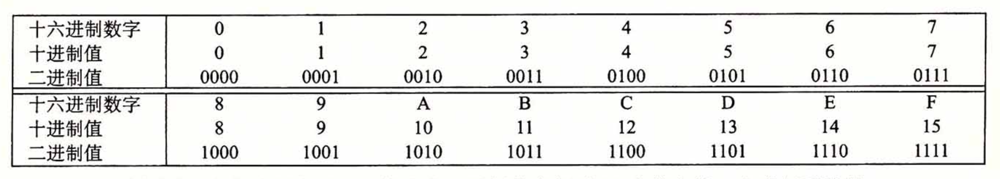

# 第2章 - 信息的表示和处理

## 2.1 信息存储
- 计算机通过二进制表示信息
- 比特和字节的基本单位
- 内存中数据的存储顺序（大端与小端）

## 2.2 整数表示
### 无符号数
- 定义：非负整数的二进制表示
- 计算公式：`数值 = ∑(位 * 2^位的位置)`
- 上溢和下溢的概念

### 补码表示
- 定义：包含负数的整数表示
- 特点：易于执行加减运算，且零的表示唯一
- 补码计算规则
- 最大值和最小值

### 进制换算图

### 亦或运算
- **按位与运算（&）**：只有当`对应位`都是 1 时，结果才是 1，否则是 0。
- **按位或运算（|）**：只要两个操作数对应的`任意一位`是 1，结果的对应位就是 1；只有当两个操作数对应的位都是 0 时，结果的对应位才是 0
- **按位取反运算（~）**：将所有的 1 变成 0，所有的 0 变成 1。
- **按位异或运算（^）**：只有当对应位不同（一个为 1，另一个为 0）时，结果才是 1，否则为 0。

### 取反
**取反**就是将一个数的每一位都反转，即将0变成1，1变成0。这种操作在计算机中称为“按位取反”或“一元取反”。
- 例如，对于二进制数 `1010` 取反后得到 `0101`
### 取补
**取补**通常指的是 **补码** 操作。在计算机中，补码是一种用来表示有符号整数的编码方式，主要用于加减运算。
补码操作分为`反码`和`补码`两个步骤：
- **反码**: 首先，对一个数的二进制表示进行取反操作（即上文的按位取反）。
- **补码**: 在反码的基础上，加1得到补码。
    - 例如，对二进制数 `1010 `取补:
        - 取反得到 `0101`。
        - 再加1，得到 `0110`，这就是补码表示
      
### 数值范围
- 无符号数和补码的范围
- 公式计算示例

## 2.3 整数运算
### 加法和减法
- 溢出检测规则
- 常用操作示例

### 乘法和除法
- 补码乘法特点
- 整数除法

## 2.4 浮点数表示
- IEEE 754标准
- 单精度和双精度浮点数
- 浮点数的三部分：符号位、指数位、尾数

### 归一化和非归一化
- 归一化浮点数表示
- 非归一化表示的特性和用途

### 特殊值
- 零、无穷大、NaN
- 特殊值的表示方法

## 2.5 浮点运算
- 浮点加法和减法
- 浮点乘法和除法
- 精度和舍入误差

## 2.6 类型转换
- 不同类型之间的转换规则
- 强制类型转换的影响

---
### 练习
- [习题](../exercises/chapter2/chapter2.c)
