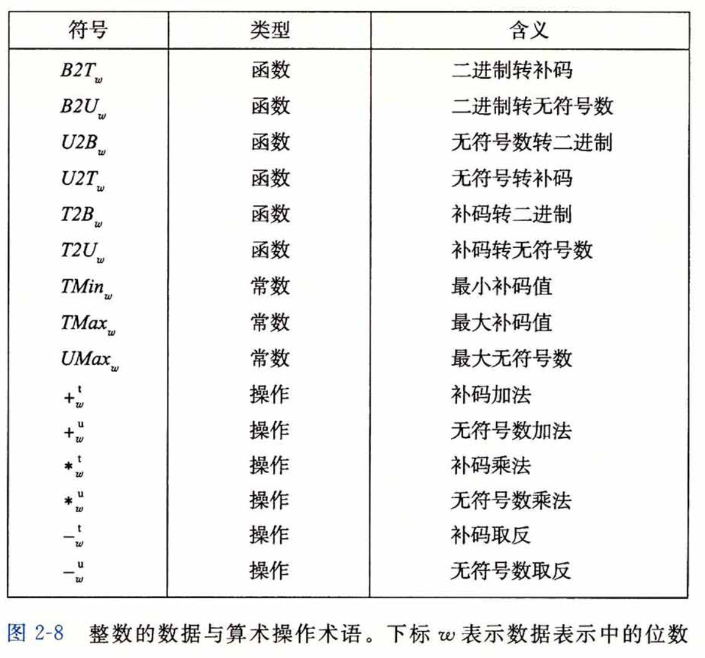

# 第2章 - 信息的表示和处理

## 2.1 信息存储
- 计算机通过二进制表示信息
- 比特和字节的基本单位
- 内存中数据的存储顺序（大端与小端）

### 进制换算图

### 亦或运算
- **按位与运算（&）**：只有当`对应位`都是 1 时，结果才是 1，否则是 0。
- **按位或运算（|）**：只要两个操作数对应的`任意一位`是 1，结果的对应位就是 1；只有当两个操作数对应的位都是 0 时，结果的对应位才是 0
- **按位取反运算（~）**：将所有的 1 变成 0，所有的 0 变成 1。
- **按位异或运算（^）**：只有当对应位不同（一个为 1，另一个为 0）时，结果才是 1，否则为 0。

### 取反
**取反**就是将一个数的每一位都反转，即将0变成1，1变成0。这种操作在计算机中称为“按位取反”或“一元取反”。
- 例如，对于二进制数 `1010` 取反后得到 `0101`
### 取补
**取补**通常指的是 **补码** 操作。在计算机中，补码是一种用来表示有符号整数的编码方式，主要用于加减运算。
补码操作分为`反码`和`补码`两个步骤：
- **反码**: 首先，对一个数的二进制表示进行取反操作（即上文的按位取反）。
- **补码**: 在反码的基础上，加1得到补码。
    - 例如，对二进制数 `1010 `取补:
        - 取反得到 `0101`。
        - 再加1，得到 `0110`，这就是补码表示

### C 语言中的移位运算
移位运算符有两种：**左移运算符** `<<` 和 **右移运算符** `>>` 移位操作经常用于位操作、位掩码处理、快速计算乘法和除法等场景.
- **左移运算 `<<`**: 会将操作数的二进制位向左移动指定的位数，在右边用` 0 `填充.
- **右移运算 `>>`**: 会将操作数的二进制位向右移动指定的位数。在左侧根据类型和编译器的不同，可能用` 0 `或符号位填充。 

在右移运算中，有两种方式：**算术右移** 和 **逻辑右移**
- **算术右移**：保留符号位，用符号位填充空位。适用于有符号数。
    - 如果是正数，最左边高位补`0`。
    - 如果是负数，右移补符号位 `1`，最高位用` 1` 补齐，以保持负数的符号。
    - 总结：
        - 对于负数的算术右移，每次右移一位，最高位用` 1 `补齐，以保持负数的符号。
        - 每次右移相当于将该数整除以` 2`（向下取整），因此负数右移通常比相应的正数偏低一级。
- **逻辑右移**：直接在左侧补 `0`。适用于无符号数。
    - 无符号整数（unsigned int）通常使用逻辑右移。

## 2.2 整数表示
### 无符号数
- 定义：非负整数的二进制表示
- 计算公式：`数值 = ∑(位 * 2^位的位置)`
- 上溢和下溢的概念
### C 有符号数跟无符号数
- 有符号数（Signed Integers）: 有符号数可以表示正数、负数和零。常见的数据类型如 int 和 short 默认都是有符号的。为了区分正负，有符号数的最高位（最左边的位）被称为符号位
    - 如果符号位是 `0`，表示正数。
    - 如果符号位是 `1`，表示负数。
    - 在有符号数中，负数通常用`补码`表示。
- 无符号数（Unsigned Integers）: 只能表示非负整数（即正数和零），没有符号位。所有位都用于表示数值，因此无符号数的范围比有符号数更大

**T2Uw :** 补码转换无符号数，例如，4位的二进制补码转无符号数 `w=4`, T2U4, 等于加上 `2^4 = 16`

**U2Tw :** 无符号数转换为补码，`<= TMaxw`(最大补码值)，直接保留数字原值, 如果 `>TMaxw`减去(2^w-1)-1

    无符号数的最大范围【0，255】
    例如: 使用 8 位二进制数, 即 w=8，(2^w-1)-1 = (2^8-1)-1 = 2^7-1 = 127
    无符号数 120 转补码: 小于127，所以补码为120
    无符号数 240 转补码: 大于或等于127，所以补码为 -16 因为: 240 - 2^w-1 = 240 - 256 = -16

### 补码表示
- 定义：包含负数的整数表示
- 特点：易于执行加减运算，且零的表示唯一
- 补码计算规则
- 最大值和最小值

### 数值范围
- 无符号数和补码的范围
- 公式计算示例

## 2.3 整数运算
### 加法和减法
- 溢出检测规则
- 常用操作示例

### 无符号加法逆元

**公式**

**符号 `u`**

符号 u 通常表示无符号数（unsigned number）。无符号数在计算时没有符号位，所有位都用于表示数值。通常情况下，u 是指无符号整数的位宽度。例如，u 可能表示 32 位或 64 位等无符号整数类型

---
**符号` w`**

符号 w 通常代表一个位宽度（bit-width），即一个数字表示所需要的位数。这里 w 可能指每个单元表示的位数。例如，w=4 表示每个数字用 4 位二进制来表示，通常在进制转换中起到关键作用。

### 乘法和除法
- 补码乘法特点
- 整数除法

## 2.4 浮点数表示
- IEEE 754标准
- 单精度和双精度浮点数
- 浮点数的三部分：符号位、指数位、尾数

### 归一化和非归一化
- 归一化浮点数表示
- 非归一化表示的特性和用途

### 特殊值
- 零、无穷大、NaN
- 特殊值的表示方法

## 2.5 浮点运算
- 浮点加法和减法
- 浮点乘法和除法
- 精度和舍入误差

## 2.6 类型转换
- 不同类型之间的转换规则
- 强制类型转换的影响

---
### 练习
- [习题](../exercises/chapter2/chapter2.c)
